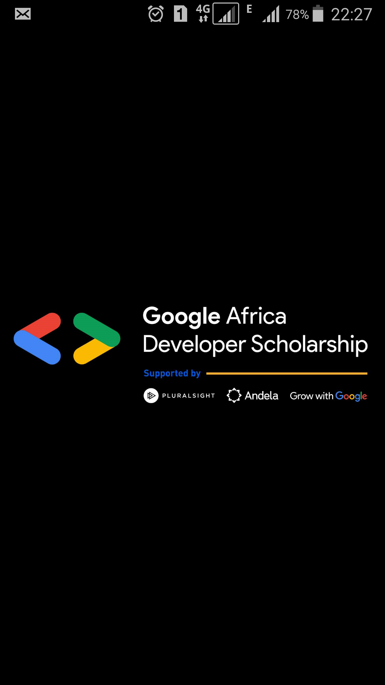
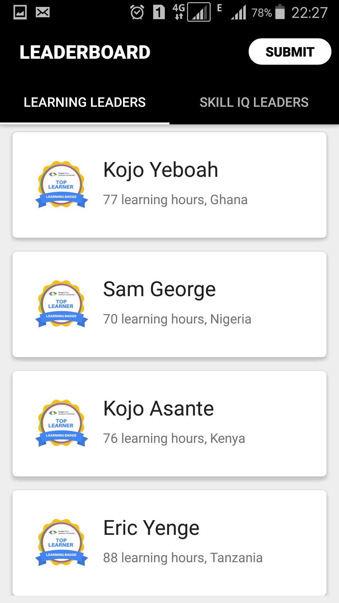
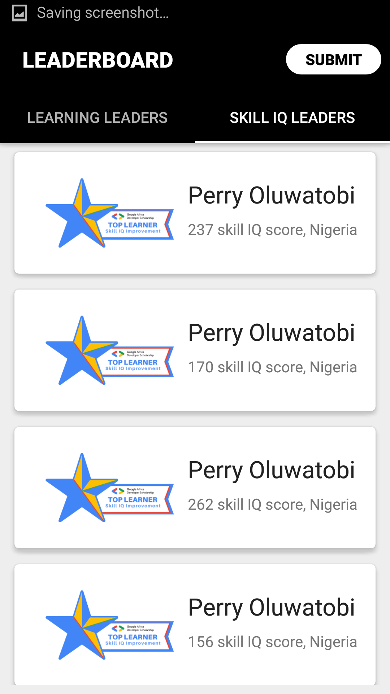
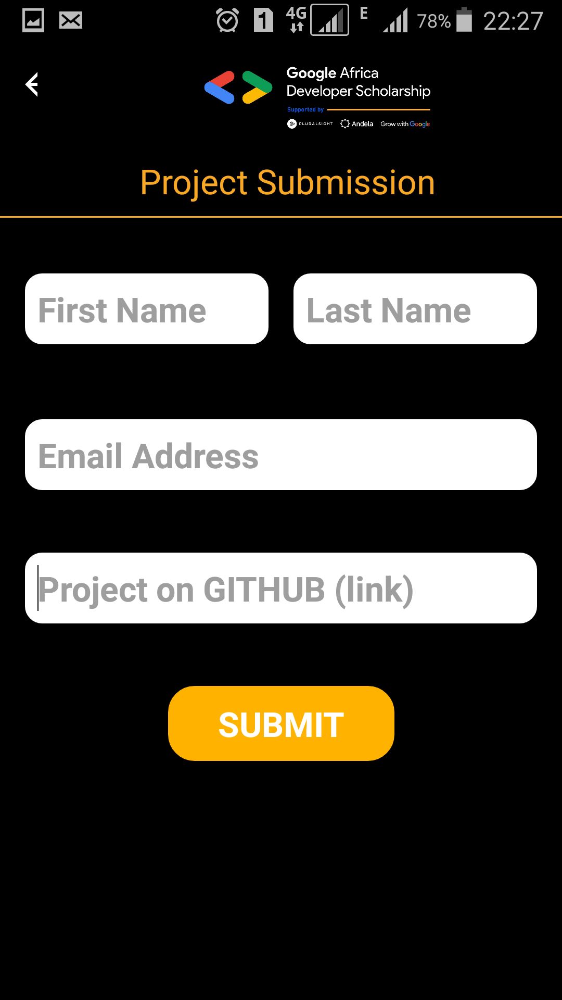
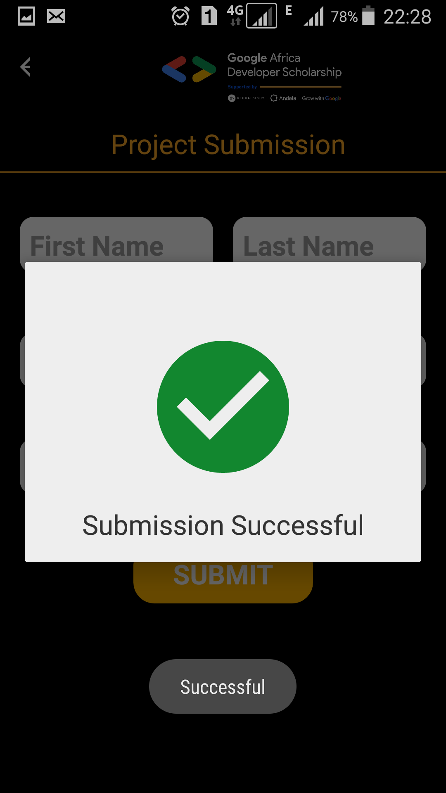
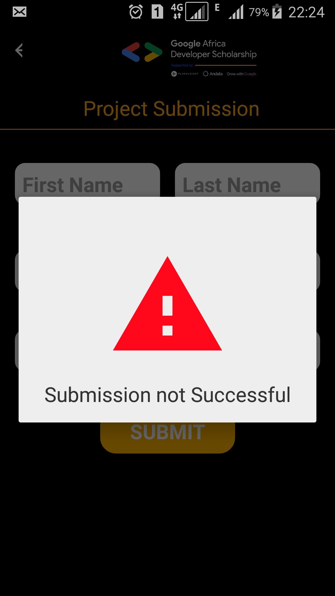

# GADS Android Leaderboard App 
Google Africa Developer Scholarship Phase II Associate Android Developer Practice Project

# Demo

## Building a GADS Leaderboard Mobile Application

### Description
This project is a very simple Android Project aimed at implementing some simple concepts that are very important as far as Android Development is concerned.

In the implementation mobile design of the GADS 2020 Leaderboard. The mobile App will display Top 20 learners in the Learning Leaders’ category and Top 20 learners in the Skill IQ Leaders’ category.

This project uses:
 - Multi-Activity Project
 - View pager
 - Customizing Toolbar
 - RecyclerView, RecyclerViewAdapter and CardView.
 - Making Network Request
 - Working with Google Form and more...

## Screenshots
 
 
 
 
 
 
 
